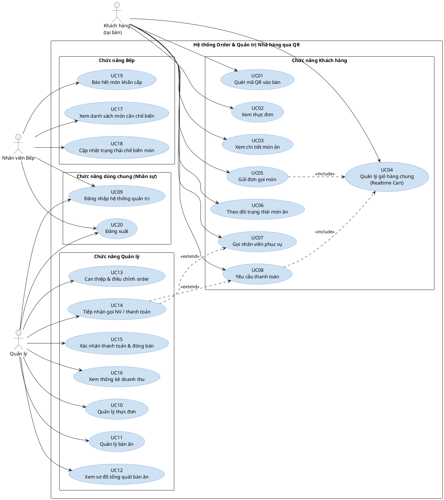
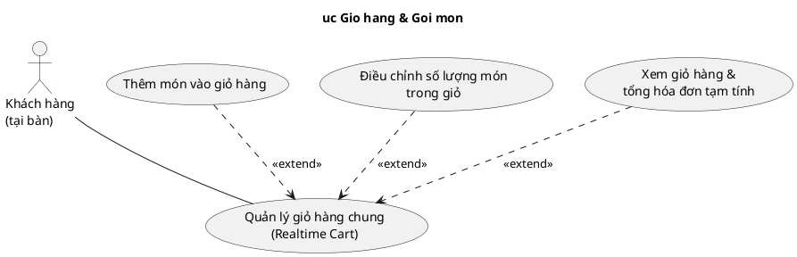
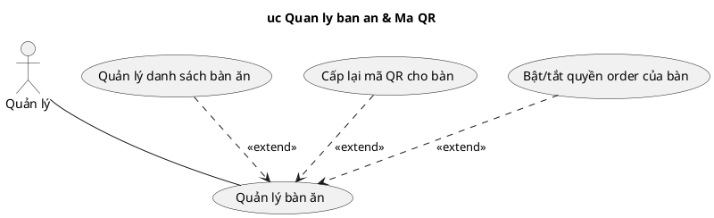
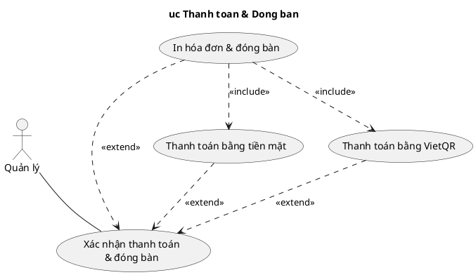

# CHƯƠNG 3: MÔ HÌNH HÓA YÊU CẦU
## Hệ thống Order & Quản trị Nhà hàng qua Mã QR (DacTa)

> Tài liệu này dựa trên các yêu cầu chức năng đã xác định ở Chương 2 của **DacTa.docx** (Bảng 1–11, Quy định QĐ1–QĐ10), được mô hình hóa theo đúng cấu trúc trình bày của **Nhom02_FinalProject.docx** (Chương 3 – Mô hình hóa): Use Case tổng quát → Lược đồ Use Case chi tiết (kèm bảng chú thích) → Đặc tả Use Case chi tiết. Các lược đồ được cung cấp dưới dạng mã nguồn **PlantUML** thay cho hình ảnh.
>
> **3 actor chính:** Khách hàng (tại bàn, không cần tài khoản), Nhân viên Bếp (Kitchen/Bar), Quản lý (Admin).

---

## 3.1 Use Case Diagram

### 3.1.1 Use Case tổng quát

**Hình 1: Lược đồ use case tổng quát**

**Bảng 1: Bảng Use Case tổng quát**

| Mã UC | Tên Use Case | Actor chính | Mô tả ngắn |
|---|---|---|---|
| UC01 | Quét mã QR vào bàn | Khách hàng | Khách quét mã QR dán tại bàn để xác thực phiên order (session_token) đúng bàn của mình. |
| UC02 | Xem thực đơn | Khách hàng | Duyệt danh sách món ăn theo danh mục (Nước lẩu, Thịt bò, Hải sản, Rau nấm, Thức uống, Bán chạy...). |
| UC03 | Xem chi tiết món ăn | Khách hàng | Xem ảnh phóng to, mô tả nguyên liệu/hương vị, giá và tình trạng còn/hết của một món cụ thể. |
| UC04 | Quản lý giỏ hàng chung (Realtime Cart) | Khách hàng | Phân hệ giỏ hàng dùng chung cho cả bàn, đồng bộ realtime; gồm thêm món (UC21), điều chỉnh số lượng (UC22), xem giỏ hàng & tổng tiền (UC23). |
| UC05 | Gửi đơn gọi món | Khách hàng | Chốt các món trong giỏ hàng, gửi một đợt order (Order Round) vào bếp. |
| UC06 | Theo dõi trạng thái món ăn | Khách hàng | Theo dõi realtime trạng thái từng món đã gọi (Đang chuẩn bị/Đã phục vụ/Đã hủy). |
| UC07 | Gọi nhân viên phục vụ | Khách hàng | Bấm chuông gọi nhân viên (xin nước đá, chén đũa, hỗ trợ...). |
| UC08 | Yêu cầu thanh toán | Khách hàng | Gửi yêu cầu thanh toán tới Quản lý kèm hóa đơn tạm tính của bàn. |
| UC09 | Đăng nhập hệ thống quản trị | Quản lý, Nhân viên Bếp | Xác thực tài khoản nhân sự bằng Email/Username và mật khẩu để cấp JWT Token, phân quyền theo vai trò. |
| UC10 | Quản lý thực đơn | Quản lý | Phân hệ quản lý món ăn (UC24), danh mục (UC25) và trạng thái còn/hết hàng (UC26). |
| UC11 | Quản lý bàn ăn | Quản lý | Phân hệ quản lý danh sách bàn (UC27), cấp lại mã QR (UC28) và khóa/mở quyền order của bàn (UC29). |
| UC12 | Xem sơ đồ tổng quát bàn ăn | Quản lý | Xem bản đồ trực quan toàn bộ bàn (trạng thái màu sắc, thời gian ngồi, tạm tính). |
| UC13 | Can thiệp & điều chỉnh order khách hàng | Quản lý | Sửa số lượng, đổi món, hủy món trong order của khách khi có sự cố. |
| UC14 | Tiếp nhận yêu cầu gọi nhân viên/thanh toán | Quản lý | Nhận và xử lý các cảnh báo chuông gọi phục vụ (UC07) hoặc yêu cầu thanh toán (UC08) từ khách. |
| UC15 | Xác nhận thanh toán & đóng bàn | Quản lý | Phân hệ chốt hóa đơn cho bàn, gồm thanh toán tiền mặt (UC30), VietQR (UC31) và in hóa đơn & đóng bàn (UC32). |
| UC16 | Xem thống kê doanh thu | Quản lý | Xem báo cáo, biểu đồ doanh thu theo Giờ/Ngày/Tuần/Tháng và Top món bán chạy. |
| UC17 | Xem danh sách món cần chế biến | Nhân viên Bếp | Xem danh sách món cần nấu, sắp xếp theo nguyên tắc FIFO (thời gian gọi). |
| UC18 | Cập nhật trạng thái chế biến món | Nhân viên Bếp | Chuyển trạng thái món từ "Đang chuẩn bị" sang "Đã phục vụ". |
| UC19 | Báo hết món khẩn cấp | Nhân viên Bếp | Tắt nhanh một món khi cạn nguyên liệu giữa ca, khóa món trên thực đơn khách ngay lập tức. |
| UC20 | Đăng xuất | Quản lý, Nhân viên Bếp | Đăng xuất khỏi hệ thống quản trị/KDS, xóa Token phiên hiện tại. |

---

### 3.1.2 Lược đồ Use Case chi tiết

#### 3.1.2.1 Lược đồ Giỏ hàng & Gọi món

**Hình 2: Lược đồ use case Giỏ hàng & Gọi món**

**Bảng 2: Bảng Use Case Giỏ hàng & Gọi món**

| Mã UC | Tên Use Case | Actor chính | Mô tả ngắn |
|---|---|---|---|
| UC21 | Thêm món vào giỏ hàng | Khách hàng | Chọn món và số lượng từ thực đơn, thêm vào giỏ hàng chung của bàn. |
| UC22 | Điều chỉnh số lượng món trong giỏ | Khách hàng | Tăng/giảm hoặc xóa một dòng món chưa gửi bếp trong giỏ hàng. |
| UC23 | Xem giỏ hàng & tổng hóa đơn tạm tính | Khách hàng | Xem toàn bộ món (đã gửi + chưa gửi) và tổng tiền tạm tính của cả bàn. |

---

#### 3.1.2.2 Lược đồ Quản lý thực đơn

**Hình 3: Lược đồ use case Quản lý thực đơn**

**Bảng 3: Bảng Use Case Quản lý thực đơn**

| Mã UC | Tên Use Case | Actor chính | Mô tả ngắn |
|---|---|---|---|
| UC24 | Quản lý danh sách món ăn | Quản lý | Thêm/sửa/xóa món ăn: tên, mô tả, giá, ảnh minh họa. |
| UC25 | Quản lý danh mục món ăn | Quản lý | Thêm/sửa/xóa danh mục và gán món ăn vào một hoặc nhiều danh mục (N-N). |
| UC26 | Cập nhật trạng thái Còn hàng/Hết hàng | Quản lý | Bật/tắt nhanh trạng thái còn hàng của một món, đồng bộ realtime tới khách hàng. |

---

#### 3.1.2.3 Lược đồ Quản lý bàn ăn & Mã QR

**Hình 4: Lược đồ use case Quản lý bàn ăn & Mã QR**

**Bảng 4: Bảng Use Case Quản lý bàn ăn & Mã QR**

| Mã UC | Tên Use Case | Actor chính | Mô tả ngắn |
|---|---|---|---|
| UC27 | Quản lý danh sách bàn ăn | Quản lý | Thêm/sửa/xóa bàn ăn: mã bàn, tên hiển thị, khu vực, sức chứa tối đa. |
| UC28 | Cấp lại mã QR cho bàn | Quản lý | Thu hồi token cũ và sinh token/QR mới cho một hoặc nhiều bàn (khi nghi lộ QR). |
| UC29 | Bật/tắt quyền order của bàn | Quản lý | Khóa/mở cờ is_order_locked để ngăn bàn gọi thêm món khi có sự cố. |

---

#### 3.1.2.4 Lược đồ Thanh toán & Đóng bàn

**Hình 5: Lược đồ use case Thanh toán & Đóng bàn**

**Bảng 5: Bảng Use Case Thanh toán & Đóng bàn**

| Mã UC | Tên Use Case | Actor chính | Mô tả ngắn |
|---|---|---|---|
| UC30 | Thanh toán bằng tiền mặt | Quản lý | Ghi nhận giao dịch thanh toán bằng tiền mặt cho hóa đơn của bàn. |
| UC31 | Thanh toán bằng VietQR | Quản lý | Sinh mã VietQR động (chuẩn Napas247) đúng số tiền hóa đơn để khách quét chuyển khoản. |
| UC32 | In hóa đơn & đóng bàn | Quản lý | In hóa đơn nhiệt khổ 80mm, lưu doanh thu, chuyển bàn sang trạng thái dọn dẹp và thu hồi mã QR hiện tại. |

---

## 3.2 Đặc tả Use Case

### 3.2.1 UC01: Quét mã QR vào bàn

| Thành phần | Nội dung |
|---|---|
| Use Case ID | UC01 |
| Use Case Name | Quét mã QR vào bàn |
| Description | Là khách hàng, tôi muốn quét mã QR dán tại bàn để vào đúng phiên order của bàn mình mà không cần đăng ký tài khoản. |
| Actor(s) | Khách hàng |
| Priority | Must have |
| Trigger | Khách hàng dùng camera điện thoại quét mã QR dán tại bàn. |
| Pre-Condition(s) | Mã QR của bàn còn hiệu lực (chưa bị thu hồi). |
| Post-Condition(s) | Trình duyệt được xác thực đúng bàn qua session_token; trang thực đơn/order của đúng bàn hiển thị; nếu bàn đang trống thì chuyển sang trạng thái "Đang có khách". |
| Basic Flow | 1. Khách hàng quét mã QR, mã chứa URL dạng `https://domain.com/order?table={id}&token={session_token}`. 2. Trình duyệt điều hướng tới URL, gửi yêu cầu xác thực token với server. 3. Hệ thống đối chiếu token với current_session_token đang hiệu lực của bàn. 4. Nếu bàn đang ở trạng thái "Bàn trống" (AVAILABLE), hệ thống tự chuyển sang "Đang có khách" (OCCUPIED) và ghi nhận thời điểm mở bàn. 5. Hệ thống trả về thông tin phiên (giỏ hàng chung hiện tại nếu có) và mở trang thực đơn (chuyển UC02). |
| Alternative Flow | 4a. Nếu bàn đã ở trạng thái "Đang có khách" (một người trong nhóm đã mở trước), hệ thống bỏ qua bước chuyển trạng thái và cho khách tham gia thẳng vào phiên hiện có, đồng bộ giỏ hàng chung đang có. |
| Exception Flow | 3a. Token không khớp hoặc đã bị thu hồi (do Quản lý cấp lại QR hoặc bàn đã đóng trước đó). - 3a1. Hệ thống hiển thị thông báo "Mã QR không còn hiệu lực, vui lòng liên hệ nhân viên". - Use Case dừng lại. |
| Business Rules | - BR01.1: Vòng đời mã QR và session token tuân theo QĐ2. - BR01.2: Trạng thái bàn tuân theo QĐ7 (Available/Occupied/Cleaning). |
| Non-Functional Requirement | - NFR01.1: Thời gian xác thực và tải trang order dưới 2 giây. |

### 3.2.2 UC02: Xem thực đơn

| Thành phần | Nội dung |
|---|---|
| Use Case ID | UC02 |
| Use Case Name | Xem thực đơn |
| Description | Là khách hàng, tôi muốn duyệt thực đơn theo danh mục để chọn món phù hợp. |
| Actor(s) | Khách hàng |
| Priority | Must have |
| Trigger | Khách hàng vào tab "Thực đơn" sau khi vào phiên order (UC01). |
| Pre-Condition(s) | Phiên bàn hợp lệ (đã qua UC01). |
| Post-Condition(s) | Danh sách món ăn theo danh mục được hiển thị; món hết hàng hiển thị mờ và không thể thêm. |
| Basic Flow | 1. Khách hàng vào tab "Thực đơn". 2. Hệ thống lấy danh sách danh mục và món ăn kèm ảnh, giá, trạng thái còn/hết. 3. Giao diện hiển thị món theo từng danh mục dạng tab cuộn (Nước lẩu, Thịt bò, Hải sản, Rau nấm, Thức uống, Bán chạy...). 4. Khách hàng chuyển tab danh mục để xem các nhóm món khác nhau. |
| Alternative Flow | 3a. Khách hàng chọn danh mục "Bán chạy" (Best Seller) → hệ thống hiển thị Top món có lượt gọi cao nhất trong 7 ngày gần nhất. |
| Exception Flow | 2a. Lỗi kết nối tới server. - 2a1. Hệ thống hiển thị "Không tải được thực đơn, vui lòng thử lại". - Use Case dừng lại. |
| Business Rules | - BR02.1: Danh mục "Bán chạy" là danh mục hệ thống tự tổng hợp theo QĐ5, không do Quản lý gán thủ công. |
| Non-Functional Requirement | - NFR02.1: Giao diện mobile-first, tối ưu cuộn theo tab danh mục. |

### 3.2.3 UC03: Xem chi tiết món ăn

| Thành phần | Nội dung |
|---|---|
| Use Case ID | UC03 |
| Use Case Name | Xem chi tiết món ăn |
| Description | Là khách hàng, tôi muốn xem chi tiết một món ăn trước khi quyết định gọi món. |
| Actor(s) | Khách hàng |
| Priority | Should have |
| Trigger | Khách hàng chạm vào một món trong danh sách thực đơn (UC02). |
| Pre-Condition(s) | Đã ở màn hình thực đơn. |
| Post-Condition(s) | Modal/trang chi tiết hiển thị ảnh phóng to, mô tả nguyên liệu/hương vị, giá và trạng thái còn/hết hàng. |
| Basic Flow | 1. Khách hàng chạm vào món ăn muốn xem. 2. Hệ thống lấy dữ liệu chi tiết của món. 3. Hiển thị chi tiết (ảnh lớn, mô tả, giá, nhãn Best Seller nếu có). 4. Khách hàng có thể thêm món vào giỏ ngay từ đây nếu món còn hàng (chuyển UC21). |
| Alternative Flow | Không có |
| Exception Flow | 4a. Món vừa chuyển sang hết hàng trong lúc xem chi tiết (do bếp/Quản lý cập nhật realtime). - 4a1. Nút "Thêm" tự động bị vô hiệu hóa, hiển thị "Món vừa hết hàng". - Use Case dừng lại. |
| Business Rules | - BR03.1: Tuân theo QĐ4 (quy định Còn hàng/Hết hàng). |
| Non-Functional Requirement | - NFR03.1: Ảnh tải theo cơ chế lazy-load để không làm chậm trang khi nhiều ảnh chất lượng cao. |

### 3.2.4 UC04: Quản lý giỏ hàng chung (Realtime Cart)

| Thành phần | Nội dung |
|---|---|
| Use Case ID | UC04 |
| Use Case Name | Quản lý giỏ hàng chung (Realtime Cart) |
| Description | Là khách hàng, tôi muốn cả bàn cùng thao tác trên một giỏ hàng chung, đồng bộ tức thì trên mọi thiết bị; gồm thêm món (UC21), điều chỉnh số lượng (UC22), xem giỏ hàng & tổng tiền (UC23). |
| Actor(s) | Khách hàng |
| Priority | Must have |
| Trigger | Khách hàng chọn biểu tượng giỏ hàng hoặc thêm món từ thực đơn. |
| Pre-Condition(s) | Phiên bàn hợp lệ. |
| Post-Condition(s) | Giỏ hàng được đồng bộ tức thì trên mọi thiết bị đang mở cùng phiên bàn. |
| Basic Flow | 1. Khách hàng thao tác trên giỏ hàng (thêm/sửa số lượng/xem). 2. Hệ thống phát sự kiện WebSocket cập nhật giỏ hàng tới toàn bộ thiết bị đang kết nối phiên bàn. 3. Mọi thiết bị nhận cập nhật realtime, hiển thị đồng nhất. |
| Alternative Flow | Không có |
| Exception Flow | 2a. Mất kết nối realtime tạm thời. - 2a1. Thiết bị tự động kết nối lại và đồng bộ lại giỏ hàng khi có mạng trở lại. |
| Business Rules | - BR04.1: Giỏ hàng chỉ tồn tại tạm thời (các món chưa gửi bếp) và bị xóa khi phiên bàn đóng (UC32). |
| Non-Functional Requirement | - NFR04.1: Độ trễ đồng bộ giữa các thiết bị trong cùng bàn dưới 1 giây. |

### 3.2.5 UC05: Gửi đơn gọi món

| Thành phần | Nội dung |
|---|---|
| Use Case ID | UC05 |
| Use Case Name | Gửi đơn gọi món |
| Description | Là khách hàng, tôi muốn gửi các món đã chọn trong giỏ hàng vào bếp thành một đợt order. |
| Actor(s) | Khách hàng |
| Priority | Must have |
| Trigger | Khách hàng nhấn "Gửi đơn vào bếp" sau khi đã chọn món trong giỏ hàng (UC04). |
| Pre-Condition(s) | Giỏ hàng có ít nhất một món; bàn không bị khóa order (is_order_locked = false). |
| Post-Condition(s) | Một Order Round mới được tạo với từng món ở trạng thái "Đang chuẩn bị"; bếp nhận được đơn theo thời gian thực. |
| Basic Flow | 1. Khách hàng xem lại giỏ hàng, nhấn "Gửi đơn vào bếp". 2. Hệ thống kiểm tra cờ is_order_locked của bàn. 3. Hệ thống tạo Order Round mới (số thứ tự đợt tăng dần), gán từng món trạng thái "Đang chuẩn bị", ghi nhận đơn giá tại thời điểm gọi. 4. Hệ thống trừ tồn kho tức thời tương ứng. 5. Hệ thống phát sự kiện realtime kèm âm thanh "Ting ting" tới màn hình Bếp và Quản lý. 6. Giỏ hàng tạm được làm trống, khách chuyển sang theo dõi trạng thái (UC06). |
| Alternative Flow | Không có |
| Exception Flow | 2a. Bàn đang bị khóa order (is_order_locked = true). - 2a1. Hệ thống từ chối với lỗi "Bàn hiện không thể gọi thêm món" (HTTP 403). - Use Case dừng lại. 4a. Một món trong giỏ vừa chuyển hết hàng trước khi gửi. - 4a1. Hệ thống loại món đó khỏi đơn và yêu cầu khách xác nhận lại trước khi gửi. |
| Business Rules | - BR05.1: Tuân theo QĐ3 (khóa order), QĐ4 (hết hàng) và QĐ9 (giới hạn số lượng 1–99 mỗi món). |
| Non-Functional Requirement | - NFR05.1: Thời gian xử lý gửi đơn và phát tín hiệu tới bếp dưới 1 giây. |

### 3.2.6 UC06: Theo dõi trạng thái món ăn

| Thành phần | Nội dung |
|---|---|
| Use Case ID | UC06 |
| Use Case Name | Theo dõi trạng thái món ăn |
| Description | Là khách hàng, tôi muốn theo dõi realtime món nào đang được nấu và món nào đã mang ra bàn. |
| Actor(s) | Khách hàng |
| Priority | Should have |
| Trigger | Khách hàng mở tab "Đơn của tôi" sau khi đã gửi ít nhất một đơn (UC05). |
| Pre-Condition(s) | Đã có ít nhất một Order Round trong phiên bàn. |
| Post-Condition(s) | Trạng thái realtime từng món (Đang chuẩn bị/Đã phục vụ/Đã hủy) được hiển thị. |
| Basic Flow | 1. Khách hàng mở tab theo dõi đơn. 2. Hệ thống lấy toàn bộ Order Round của phiên bàn hiện tại, nhóm theo đợt gọi. 3. Khi bếp cập nhật trạng thái món (UC18) hoặc Quản lý hủy món (UC13), hệ thống đẩy realtime cập nhật giao diện khách ngay lập tức. |
| Alternative Flow | Không có |
| Exception Flow | Không có |
| Business Rules | - BR06.1: Tuân theo QĐ8 (trạng thái món: Đang chuẩn bị/Đã phục vụ/Đã hủy). |
| Non-Functional Requirement | - NFR06.1: Cập nhật trạng thái hiển thị tức thời (dưới 1 giây), không cần tải lại trang. |

### 3.2.7 UC07: Gọi nhân viên phục vụ

| Thành phần | Nội dung |
|---|---|
| Use Case ID | UC07 |
| Use Case Name | Gọi nhân viên phục vụ |
| Description | Là khách hàng, tôi muốn bấm chuông gọi nhân viên khi cần hỗ trợ (xin nước đá, chén đũa...). |
| Actor(s) | Khách hàng |
| Priority | Should have |
| Trigger | Khách hàng nhấn nút chuông "Gọi nhân viên". |
| Pre-Condition(s) | Phiên bàn hợp lệ. |
| Post-Condition(s) | Thông báo kèm âm thanh được gửi tới màn hình Quản lý (UC14). |
| Basic Flow | 1. Khách hàng nhấn nút gọi nhân viên (có thể chọn lý do nhanh: xin nước đá/chén đũa/khác). 2. Hệ thống kiểm tra thời gian lần gọi gần nhất của bàn. 3. Hệ thống ghi log yêu cầu và phát sự kiện realtime kèm âm thanh "Ting ting" tới màn hình Quản lý. 4. Giao diện khách hiển thị "Đã gửi yêu cầu, nhân viên đang đến!". |
| Alternative Flow | Không có |
| Exception Flow | 2a. Khách bấm liên tục trong vòng 30 giây kể từ lần gọi trước. - 2a1. Hệ thống không tạo yêu cầu mới, chỉ hiển thị lại thông báo "Yêu cầu của bạn đã được gửi, nhân viên đang đến!". - Use Case dừng lại. |
| Business Rules | - BR07.1: Tuân theo QĐ10 (Rate Limiting 30 giây/lần gọi). |
| Non-Functional Requirement | - NFR07.1: Âm thanh và hiệu ứng cảnh báo phải đủ nổi bật để nhân viên không bỏ sót giữa ca đông khách. |

### 3.2.8 UC08: Yêu cầu thanh toán

| Thành phần | Nội dung |
|---|---|
| Use Case ID | UC08 |
| Use Case Name | Yêu cầu thanh toán |
| Description | Là khách hàng, tôi muốn báo cho Quản lý biết bàn tôi đã sẵn sàng thanh toán. |
| Actor(s) | Khách hàng |
| Priority | Must have |
| Trigger | Khách hàng nhấn nút "Yêu cầu thanh toán". |
| Pre-Condition(s) | Bàn đang có ít nhất một Order Round đã gửi bếp. |
| Post-Condition(s) | Yêu cầu thanh toán được gửi tới Quản lý kèm tổng tiền tạm tính (UC14). |
| Basic Flow | 1. Khách hàng xem tổng hóa đơn tạm tính (UC23) và chọn phương thức mong muốn (chỉ là nguyện vọng tham khảo, việc xác nhận cuối do Quản lý thực hiện ở UC15). 2. Khách hàng nhấn "Yêu cầu thanh toán". 3. Hệ thống ghi log yêu cầu, phát sự kiện realtime kèm âm thanh tới màn hình Quản lý. 4. Giao diện khách hiển thị "Yêu cầu thanh toán đã được gửi, vui lòng chờ nhân viên". |
| Alternative Flow | Không có |
| Exception Flow | 3a. Bàn chưa có món nào được gửi bếp (chỉ có giỏ hàng tạm chưa order). - 3a1. Hệ thống từ chối, báo "Bàn chưa có đơn gọi món nào để thanh toán". - Use Case dừng lại. |
| Business Rules | - BR08.1: Tổng tiền tạm tính tuân theo công thức QĐ1. |
| Non-Functional Requirement | - NFR08.1: Tổng tiền tạm tính hiển thị phải khớp chính xác với công thức tính hóa đơn cuối cùng (không sai lệch làm tròn). |

### 3.2.9 UC09: Đăng nhập hệ thống quản trị

| Thành phần | Nội dung |
|---|---|
| Use Case ID | UC09 |
| Use Case Name | Đăng nhập hệ thống quản trị |
| Description | Là Quản lý/Nhân viên Bếp, tôi muốn đăng nhập để được cấp quyền truy cập đúng phân hệ của mình (Dashboard quản trị hoặc màn hình điều phối bếp KDS). |
| Actor(s) | Quản lý, Nhân viên Bếp |
| Priority | Must have |
| Trigger | Người dùng mở trang đăng nhập, nhập tài khoản. |
| Pre-Condition(s) | Tài khoản đã tồn tại trong hệ thống. |
| Post-Condition(s) | Người dùng được cấp JWT Token kèm vai trò và truy cập đúng phân hệ tương ứng. |
| Basic Flow | 1. Người dùng nhập username/email và mật khẩu, nhấn "Đăng nhập". 2. Hệ thống kiểm tra thông tin, đối chiếu với mật khẩu đã băm trong Database. 3. Hệ thống cấp JWT Token kèm vai trò (Manager/Kitchen). 4. Hệ thống chuyển hướng vào Dashboard quản trị (Quản lý) hoặc màn hình KDS (Nhân viên Bếp) tương ứng. |
| Alternative Flow | Không có |
| Exception Flow | 2a. Sai tài khoản hoặc mật khẩu. - 2a1. Hệ thống báo lỗi "Thông tin đăng nhập không chính xác". - Use Case dừng lại. |
| Business Rules | - BR09.1: Phân quyền RBAC (Manager/Kitchen) được áp dụng nghiêm ngặt tại tầng API. |
| Non-Functional Requirement | - NFR09.1: Thời gian xác thực không quá 2 giây. |

### 3.2.10 UC10: Quản lý thực đơn

| Thành phần | Nội dung |
|---|---|
| Use Case ID | UC10 |
| Use Case Name | Quản lý thực đơn |
| Description | Là quản lý, tôi muốn truy cập phân hệ quản lý thực đơn. Phân hệ gồm: quản lý danh sách món ăn (UC24), quản lý danh mục (UC25) và cập nhật trạng thái còn/hết hàng (UC26). |
| Actor(s) | Quản lý |
| Priority | Must have |
| Trigger | Quản lý chọn mục "Quản lý thực đơn" trên Dashboard. |
| Pre-Condition(s) | Tài khoản có role Manager. |
| Post-Condition(s) | Giao diện tổng hợp thực đơn (món ăn + danh mục) được hiển thị. |
| Basic Flow | 1. Quản lý chọn "Quản lý thực đơn". 2. Hệ thống tải danh sách món ăn và danh mục hiện có. 3. Quản lý chọn tiếp thao tác con: UC24, UC25 hoặc UC26. |
| Alternative Flow | Không có |
| Exception Flow | 2a. Tài khoản không có role Manager. - 2a1. Hệ thống báo lỗi "Bạn không có quyền truy cập". - Use Case dừng lại. |
| Business Rules | Không có (xem quy định riêng của từng UC con). |
| Non-Functional Requirement | - NFR10.1: Danh sách hỗ trợ tìm kiếm/lọc theo tên món hoặc danh mục. |

### 3.2.11 UC11: Quản lý bàn ăn

| Thành phần | Nội dung |
|---|---|
| Use Case ID | UC11 |
| Use Case Name | Quản lý bàn ăn |
| Description | Là quản lý, tôi muốn truy cập phân hệ quản lý bàn ăn. Phân hệ gồm: quản lý danh sách bàn (UC27), cấp lại mã QR (UC28) và bật/tắt quyền order (UC29). |
| Actor(s) | Quản lý |
| Priority | Must have |
| Trigger | Quản lý chọn mục "Quản lý bàn ăn" trên Dashboard. |
| Pre-Condition(s) | Tài khoản có role Manager. |
| Post-Condition(s) | Danh sách bàn kèm trạng thái, mã QR, cờ khóa order được hiển thị. |
| Basic Flow | 1. Quản lý chọn "Quản lý bàn ăn". 2. Hệ thống tải danh sách bàn hiện có kèm trạng thái vận hành. 3. Quản lý chọn tiếp thao tác con: UC27, UC28 hoặc UC29. |
| Alternative Flow | Không có |
| Exception Flow | 2a. Tài khoản không có role Manager. - 2a1. Hệ thống báo lỗi "Bạn không có quyền truy cập". - Use Case dừng lại. |
| Business Rules | Không có (xem quy định riêng của từng UC con). |
| Non-Functional Requirement | - NFR11.1: Hiển thị trạng thái bàn realtime, đồng bộ với sơ đồ tổng quát (UC12). |

### 3.2.12 UC12: Xem sơ đồ tổng quát bàn ăn

| Thành phần | Nội dung |
|---|---|
| Use Case ID | UC12 |
| Use Case Name | Xem sơ đồ tổng quát bàn ăn |
| Description | Là quản lý, tôi muốn xem toàn cảnh mặt bằng các bàn ăn để nắm nhanh tình hình vận hành. |
| Actor(s) | Quản lý |
| Priority | Must have |
| Trigger | Quản lý mở trang Dashboard chính/"Sơ đồ bàn ăn". |
| Pre-Condition(s) | Tài khoản có role Manager. |
| Post-Condition(s) | Bản đồ trực quan toàn bộ bàn (màu sắc theo trạng thái, thời gian ngồi, tạm tính) được hiển thị. |
| Basic Flow | 1. Quản lý mở trang sơ đồ bàn. 2. Hệ thống lấy trạng thái tất cả bàn (Trống/Đang có khách/Đang dọn dẹp), thời điểm mở bàn và tổng tạm tính hiện tại của từng bàn đang có khách. 3. Giao diện hiển thị mặt bằng bàn bằng màu sắc phân biệt theo trạng thái. 4. Quản lý bấm vào một bàn để xem chi tiết order (UC13) hoặc xác nhận thanh toán (UC15). |
| Alternative Flow | Không có |
| Exception Flow | Không có |
| Business Rules | - BR12.1: Tuân theo QĐ7 (3 trạng thái bàn cố định). |
| Non-Functional Requirement | - NFR12.1: Sơ đồ tự động làm mới (realtime) mỗi khi trạng thái bàn thay đổi, không cần tải lại trang. |

### 3.2.13 UC13: Can thiệp & điều chỉnh order khách hàng

| Thành phần | Nội dung |
|---|---|
| Use Case ID | UC13 |
| Use Case Name | Can thiệp & điều chỉnh order khách hàng |
| Description | Là quản lý, tôi muốn sửa số lượng, đổi món hoặc hủy món trong order của khách khi xảy ra sự cố (hết nguyên liệu đột xuất, khách đổi ý). |
| Actor(s) | Quản lý |
| Priority | Should have |
| Trigger | Từ sơ đồ bàn (UC12) hoặc danh sách bếp (UC17), Quản lý chọn một bàn/đơn để chỉnh sửa. |
| Pre-Condition(s) | Tài khoản có role Manager; order đang tồn tại và chưa thanh toán xong. |
| Post-Condition(s) | Order được điều chỉnh (sửa số lượng, đổi món, hủy món kèm lý do), có ghi log can thiệp. |
| Basic Flow | 1. Quản lý mở chi tiết order của bàn. 2. Quản lý chọn món cần sửa/hủy, nhập lý do nếu hủy. 3. Hệ thống cập nhật Database, ghi log Audit (ai can thiệp, lúc nào, lý do). 4. Hệ thống phát realtime cập nhật cho khách hàng (UC06) và bếp (nếu món đang chờ nấu). |
| Alternative Flow | Không có |
| Exception Flow | 3a. Món đã ở trạng thái "Đã phục vụ". - 3a1. Hệ thống không cho phép hủy món, chỉ cho phép ghi chú điều chỉnh hóa đơn thủ công riêng. - Use Case dừng lại. |
| Business Rules | - BR13.1: Mọi can thiệp phải được ghi vào Nhật ký hỗ trợ & Can thiệp (Audit & Call Staff Logs). |
| Non-Functional Requirement | - NFR13.1: Thao tác chỉnh sửa phải phản ánh ngay trên hóa đơn tạm tính của bàn. |

### 3.2.14 UC14: Tiếp nhận yêu cầu gọi nhân viên/thanh toán

| Thành phần | Nội dung |
|---|---|
| Use Case ID | UC14 |
| Use Case Name | Tiếp nhận yêu cầu gọi nhân viên/thanh toán |
| Description | Là quản lý, tôi muốn nhận và xử lý các cảnh báo chuông gọi phục vụ hoặc yêu cầu thanh toán từ khách hàng theo thời gian thực. |
| Actor(s) | Quản lý |
| Priority | Must have |
| Trigger | Hệ thống nhận sự kiện realtime từ UC07 (Gọi nhân viên) hoặc UC08 (Yêu cầu thanh toán). |
| Pre-Condition(s) | Tài khoản có role Manager đang mở Dashboard. |
| Post-Condition(s) | Yêu cầu được đánh dấu đã tiếp nhận/xử lý. |
| Basic Flow | 1. Hệ thống phát âm thanh và hiển thị thẻ cảnh báo (số bàn, loại yêu cầu) trên Dashboard. 2. Quản lý xác nhận đã tiếp nhận (bấm "Đã xử lý"). 3. Hệ thống ẩn cảnh báo và ghi log thời gian phản hồi. |
| Alternative Flow | Không có |
| Exception Flow | Không có |
| Business Rules | - BR14.1: Yêu cầu được lưu vào Nhật ký hỗ trợ & Can thiệp để thống kê thời gian phản hồi. |
| Non-Functional Requirement | - NFR14.1: Âm thanh cảnh báo phải phát liên tục cho đến khi được xác nhận. |

### 3.2.15 UC15: Xác nhận thanh toán & đóng bàn

| Thành phần | Nội dung |
|---|---|
| Use Case ID | UC15 |
| Use Case Name | Xác nhận thanh toán & đóng bàn |
| Description | Là quản lý, tôi muốn truy cập phân hệ chốt hóa đơn cho một bàn. Phân hệ gồm: thanh toán tiền mặt (UC30), thanh toán VietQR (UC31) và in hóa đơn & đóng bàn (UC32). |
| Actor(s) | Quản lý |
| Priority | Must have |
| Trigger | Nhận yêu cầu thanh toán (UC14) hoặc Quản lý chủ động chọn từ sơ đồ bàn (UC12). |
| Pre-Condition(s) | Tài khoản có role Manager; bàn đang "Đang có khách" và có ít nhất một Order Round. |
| Post-Condition(s) | Hóa đơn được lập, bàn chuyển sang "Đang dọn dẹp", mã QR cũ bị thu hồi. |
| Basic Flow | 1. Quản lý mở màn hình thanh toán của bàn, hệ thống tính tổng hóa đơn theo QĐ1. 2. Quản lý chọn phương thức (chuyển UC30 hoặc UC31). 3. Sau khi xác nhận đã thu tiền, hệ thống chuyển sang UC32 để in hóa đơn & đóng bàn. |
| Alternative Flow | Không có |
| Exception Flow | 1a. Có món đang ở trạng thái "Đang chuẩn bị" chưa phục vụ xong. - 1a1. Hệ thống cảnh báo, yêu cầu Quản lý xác nhận trước khi cho phép thanh toán. |
| Business Rules | Không có (xem quy định riêng của từng UC con). |
| Non-Functional Requirement | - NFR15.1: Toàn bộ quy trình thanh toán – đóng bàn phải hoàn tất trong dưới 1 phút thao tác. |

### 3.2.16 UC16: Xem thống kê doanh thu

| Thành phần | Nội dung |
|---|---|
| Use Case ID | UC16 |
| Use Case Name | Xem thống kê doanh thu |
| Description | Là quản lý, tôi muốn xem báo cáo, biểu đồ doanh thu để đánh giá hiệu quả kinh doanh. |
| Actor(s) | Quản lý |
| Priority | Should have |
| Trigger | Quản lý chọn mục "Dashboard doanh thu". |
| Pre-Condition(s) | Tài khoản có role Manager. |
| Post-Condition(s) | Biểu đồ và bảng số liệu doanh thu (BM1) được hiển thị. |
| Basic Flow | 1. Quản lý chọn kỳ thống kê (Hôm nay/Tuần này/Tháng). 2. Hệ thống tính tổng doanh thu, tổng lượt bàn, doanh thu trung bình/bàn (QĐ6) và Top món bán chạy. 3. Hệ thống hiển thị biểu đồ cột/đường/tròn tương ứng. |
| Alternative Flow | Không có |
| Exception Flow | Không có |
| Business Rules | - BR16.1: Doanh thu trung bình tính theo công thức QĐ6. |
| Non-Functional Requirement | - NFR16.1: Biểu đồ sử dụng thư viện trực quan (VD: Chart.js) tải qua CDN. |

### 3.2.17 UC17: Xem danh sách món cần chế biến

| Thành phần | Nội dung |
|---|---|
| Use Case ID | UC17 |
| Use Case Name | Xem danh sách món cần chế biến |
| Description | Là nhân viên bếp, tôi muốn xem danh sách món cần nấu theo đúng thứ tự thời gian gọi để không bỏ sót đơn. |
| Actor(s) | Nhân viên Bếp |
| Priority | Must have |
| Trigger | Nhân viên bếp mở màn hình điều phối bếp (KDS). |
| Pre-Condition(s) | Tài khoản có role Kitchen. |
| Post-Condition(s) | Danh sách món cần nấu hiển thị theo nguyên tắc FIFO (thời gian gọi). |
| Basic Flow | 1. Nhân viên bếp mở màn hình KDS. 2. Hệ thống lấy toàn bộ món đang ở trạng thái "Đang chuẩn bị", sắp xếp theo thời điểm gọi tăng dần, kèm số bàn, đợt gọi và ghi chú món. 3. Hệ thống hiển thị bộ đếm giờ (elapsed time) cho từng món để cảnh báo món chờ lâu. |
| Alternative Flow | Không có |
| Exception Flow | Không có |
| Business Rules | - BR17.1: Tuân theo QĐ8 (trạng thái món). |
| Non-Functional Requirement | - NFR17.1: Màn hình phải tự làm mới realtime khi có đơn mới, không cần thao tác thủ công. |

### 3.2.18 UC18: Cập nhật trạng thái chế biến món

| Thành phần | Nội dung |
|---|---|
| Use Case ID | UC18 |
| Use Case Name | Cập nhật trạng thái chế biến món |
| Description | Là nhân viên bếp, tôi muốn đánh dấu một món đã nấu xong để khách và Quản lý biết. |
| Actor(s) | Nhân viên Bếp |
| Priority | Must have |
| Trigger | Nhân viên bếp nấu xong một món, chạm vào thẻ món trên màn hình KDS. |
| Pre-Condition(s) | Món đang ở trạng thái "Đang chuẩn bị". |
| Post-Condition(s) | Món chuyển sang trạng thái "Đã phục vụ"; khách hàng và Quản lý thấy cập nhật realtime. |
| Basic Flow | 1. Nhân viên bếp chạm vào món đã hoàn thành. 2. Hệ thống cập nhật trạng thái món = "Đã phục vụ", ghi nhận thời điểm hoàn thành. 3. Hệ thống phát realtime cập nhật tới khách hàng (UC06) và Quản lý. |
| Alternative Flow | Không có |
| Exception Flow | 1a. Món đã bị Quản lý hủy trước đó (UC13). - 1a1. Thẻ món tự động biến mất khỏi màn hình KDS, không cho thao tác. - Use Case dừng lại. |
| Business Rules | - BR18.1: Tuân theo QĐ8 (trạng thái món). |
| Non-Functional Requirement | - NFR18.1: Thao tác cập nhật trạng thái chỉ cần một chạm (one-tap) để tối ưu tốc độ trong giờ cao điểm. |

### 3.2.19 UC19: Báo hết món khẩn cấp

| Thành phần | Nội dung |
|---|---|
| Use Case ID | UC19 |
| Use Case Name | Báo hết món khẩn cấp |
| Description | Là nhân viên bếp, tôi muốn tắt nhanh một món khi cạn nguyên liệu giữa ca để tránh khách tiếp tục đặt món đó. |
| Actor(s) | Nhân viên Bếp |
| Priority | Must have |
| Trigger | Nhân viên bếp phát hiện nguyên liệu của một món đã cạn. |
| Pre-Condition(s) | Tài khoản có role Kitchen. |
| Post-Condition(s) | Món chuyển trạng thái "Hết hàng"; khách hàng không thể thêm món đó nữa. |
| Basic Flow | 1. Nhân viên bếp chọn món cần báo hết trên màn hình KDS. 2. Nhân viên xác nhận "Báo hết hàng". 3. Hệ thống cập nhật trạng thái món = Hết hàng, phát sự kiện WebSocket broadcast tới toàn bộ khách hàng đang xem thực đơn. 4. Trên giao diện khách, nút "Thêm" của món đó bị vô hiệu hóa; món trong giỏ tạm (chưa gửi bếp) bị cảnh báo gỡ bỏ. |
| Alternative Flow | Không có |
| Exception Flow | Không có |
| Business Rules | - BR19.1: Tuân theo QĐ4 (quy định Còn hàng/Hết hàng). |
| Non-Functional Requirement | - NFR19.1: Việc đồng bộ trạng thái hết hàng tới toàn bộ thiết bị khách phải tức thời (dưới 1 giây) để tránh đặt nhầm. |

### 3.2.20 UC20: Đăng xuất

| Thành phần | Nội dung |
|---|---|
| Use Case ID | UC20 |
| Use Case Name | Đăng xuất |
| Description | Là quản lý/nhân viên bếp, tôi muốn đăng xuất khỏi hệ thống để bảo mật phiên làm việc. |
| Actor(s) | Quản lý, Nhân viên Bếp |
| Priority | Must have |
| Trigger | Người dùng chọn nút "Đăng xuất". |
| Pre-Condition(s) | Người dùng đang trong trạng thái đã đăng nhập. |
| Post-Condition(s) | Phiên làm việc kết thúc. |
| Basic Flow | 1. Người dùng chọn "Đăng xuất". 2. Client xóa JWT Token khỏi bộ nhớ cục bộ. 3. Hệ thống chuyển hướng về trang đăng nhập. |
| Alternative Flow | Không có |
| Exception Flow | Không có |
| Business Rules | - BR20.1: Token JWT đã cấp vẫn còn hiệu lực tới khi hết hạn tự nhiên (hệ thống hiện không triển khai blacklist/revocation phía server) — hạn chế đã biết, được đánh đổi bằng thời gian sống (TTL) của token đủ ngắn. |
| Non-Functional Requirement | - NFR20.1: Thời gian thực hiện đăng xuất phản hồi tức thời (dưới 1 giây). |

### 3.2.21 UC21: Thêm món vào giỏ hàng

| Thành phần | Nội dung |
|---|---|
| Use Case ID | UC21 |
| Use Case Name | Thêm món vào giỏ hàng |
| Description | Là khách hàng, tôi muốn thêm một món ăn với số lượng mong muốn vào giỏ hàng chung của bàn. |
| Actor(s) | Khách hàng |
| Priority | Must have |
| Trigger | Khách hàng nhấn nút "Thêm" trên một món tại thực đơn (UC02) hoặc trang chi tiết món (UC03). |
| Pre-Condition(s) | Món đang ở trạng thái Còn hàng; bàn chưa bị khóa order. |
| Post-Condition(s) | Món được thêm vào giỏ hàng chung, đồng bộ tới mọi thiết bị trong bàn. |
| Basic Flow | 1. Khách hàng chọn món và số lượng mong muốn (mặc định 1), nhấn "Thêm vào giỏ". 2. Hệ thống kiểm tra món còn hàng và bàn chưa bị khóa order. 3. Hệ thống thêm/cộng dồn dòng món vào giỏ hàng chung của phiên bàn kèm ghi chú (nếu có). 4. Hệ thống phát sự kiện realtime cập nhật giỏ hàng tới toàn bộ thiết bị của bàn. |
| Alternative Flow | Không có |
| Exception Flow | 2a. Món vừa chuyển hết hàng ngay lúc thêm. - 2a1. Hệ thống từ chối, báo "Món vừa hết hàng, vui lòng chọn món khác". - Use Case dừng lại. 2b. Bàn đang bị khóa order. - 2b1. Hệ thống báo "Bàn hiện không thể thêm món". - Use Case dừng lại. |
| Business Rules | - BR21.1: Tuân theo QĐ9 (giới hạn số lượng 1–99 mỗi lần thêm). |
| Non-Functional Requirement | - NFR21.1: Đồng bộ giỏ hàng giữa các thiết bị trong bàn dưới 1 giây. |

### 3.2.22 UC22: Điều chỉnh số lượng món trong giỏ

| Thành phần | Nội dung |
|---|---|
| Use Case ID | UC22 |
| Use Case Name | Điều chỉnh số lượng món trong giỏ |
| Description | Là khách hàng, tôi muốn tăng/giảm số lượng hoặc xóa một món chưa gửi bếp trong giỏ hàng. |
| Actor(s) | Khách hàng |
| Priority | Should have |
| Trigger | Khách hàng mở giỏ hàng (UC23), chạm nút +/- hoặc nhập số lượng cho một dòng món chưa gửi bếp. |
| Pre-Condition(s) | Dòng món đang ở trạng thái "chưa gửi" (còn trong giỏ tạm, chưa qua UC05). |
| Post-Condition(s) | Số lượng dòng món được cập nhật (hoặc dòng bị xóa nếu về 0); tổng tiền tạm tính được tính lại. |
| Basic Flow | 1. Khách hàng mở giỏ hàng, chọn dòng món cần sửa. 2. Khách hàng tăng/giảm số lượng hoặc nhập trực tiếp. 3. Hệ thống kiểm tra giá trị hợp lệ (1 ≤ N ≤ 99). 4. Hệ thống cập nhật thành tiền dòng đó (đơn giá × số lượng) và tính lại tổng giỏ hàng. 5. Hệ thống phát realtime đồng bộ tới các thiết bị khác trong bàn. |
| Alternative Flow | 2a. Khách hàng giảm số lượng về 0 → dòng món bị xóa khỏi giỏ hàng. |
| Exception Flow | 3a. Người dùng nhập số âm, số 0 (ngoài thao tác xóa), số thập phân hoặc ký tự chữ. - 3a1. Hệ thống từ chối và giữ nguyên giá trị cũ. |
| Business Rules | - BR22.1: Tuân theo QĐ9 (giới hạn số lượng). |
| Non-Functional Requirement | - NFR22.1: Thao tác +/- phải phản hồi tức thời trên giao diện (optimistic UI) trước khi xác nhận từ server. |

### 3.2.23 UC23: Xem giỏ hàng & tổng hóa đơn tạm tính

| Thành phần | Nội dung |
|---|---|
| Use Case ID | UC23 |
| Use Case Name | Xem giỏ hàng & tổng hóa đơn tạm tính |
| Description | Là khách hàng, tôi muốn xem toàn bộ món (đã gửi và chưa gửi) cùng tổng hóa đơn tạm tính của cả bàn. |
| Actor(s) | Khách hàng |
| Priority | Must have |
| Trigger | Khách hàng chạm biểu tượng giỏ hàng. |
| Pre-Condition(s) | Phiên bàn hợp lệ. |
| Post-Condition(s) | Danh sách món (chưa gửi + đã gửi các đợt trước) và tổng hóa đơn tạm tính toàn bàn được hiển thị. |
| Basic Flow | 1. Khách hàng mở giỏ hàng. 2. Hệ thống lấy toàn bộ dòng món trong giỏ tạm (chưa gửi) và toàn bộ Order Round đã gửi của phiên bàn. 3. Hệ thống tính tổng tiền tạm tính theo QĐ1 (chưa gồm chiết khấu/VAT cuối cùng). 4. Hệ thống hiển thị danh sách kèm trạng thái từng món (đã gửi: Đang chuẩn bị/Đã phục vụ; chưa gửi: có thể sửa/xóa) và nút "Gửi đơn" (UC05). |
| Alternative Flow | Không có |
| Exception Flow | Không có |
| Business Rules | - BR23.1: Tuân theo QĐ1 (công thức tính tổng tiền hóa đơn). |
| Non-Functional Requirement | - NFR23.1: Tổng tiền hiển thị phải cập nhật tức thời mỗi khi giỏ hàng hoặc trạng thái món thay đổi. |

### 3.2.24 UC24: Quản lý danh sách món ăn

| Thành phần | Nội dung |
|---|---|
| Use Case ID | UC24 |
| Use Case Name | Quản lý danh sách món ăn |
| Description | Là quản lý, tôi muốn thêm/sửa/xóa món ăn trong thực đơn. |
| Actor(s) | Quản lý |
| Priority | Must have |
| Trigger | Quản lý chọn "Danh sách món ăn" trong Quản lý thực đơn (UC10). |
| Pre-Condition(s) | Tài khoản có role Manager. |
| Post-Condition(s) | Món ăn được thêm mới/cập nhật/xóa (ẩn) trong hệ thống, đồng bộ ngay ra thực đơn khách. |
| Basic Flow | 1. Quản lý xem danh sách món (BM2), chọn "Thêm món" hoặc chọn một món để "Sửa"/"Xóa". 2. Với thêm/sửa: nhập tên món, mô tả, đơn giá, tải một ảnh minh họa, gán danh mục (UC25). 3. Hệ thống lưu vào Database (sinh mã món mới nếu là thêm mới). 4. Hệ thống phát realtime cập nhật thực đơn tới toàn bộ khách hàng đang xem. |
| Alternative Flow | Không có |
| Exception Flow | 3a. Thiếu trường bắt buộc (tên món, giá) hoặc ảnh sai định dạng/quá dung lượng. - 3a1. Hệ thống từ chối lưu và báo lỗi cụ thể. - Use Case dừng lại. |
| Business Rules | - BR24.1: Xóa món chỉ nên là "ẩn" (soft delete) để không phá vỡ dữ liệu lịch sử order đã tham chiếu tới món đó. |
| Non-Functional Requirement | - NFR24.1: Ảnh món ăn nên được tối ưu/nén trước khi lưu để đảm bảo tốc độ tải thực đơn. |

### 3.2.25 UC25: Quản lý danh mục món ăn

| Thành phần | Nội dung |
|---|---|
| Use Case ID | UC25 |
| Use Case Name | Quản lý danh mục món ăn |
| Description | Là quản lý, tôi muốn thêm/sửa/xóa danh mục và gán món ăn vào một hoặc nhiều danh mục. |
| Actor(s) | Quản lý |
| Priority | Should have |
| Trigger | Quản lý chọn "Danh mục" trong Quản lý thực đơn (UC10). |
| Pre-Condition(s) | Tài khoản có role Manager. |
| Post-Condition(s) | Danh mục được thêm/sửa/xóa; món ăn có thể được gán vào nhiều danh mục. |
| Basic Flow | 1. Quản lý xem danh sách danh mục hiện có, chọn "Thêm danh mục" hoặc sửa/xóa một danh mục. 2. Quản lý nhập tên danh mục, mô tả, thứ tự hiển thị. 3. Quản lý gán/bỏ gán món ăn vào danh mục (quan hệ N-N) qua giao diện đa chọn. 4. Hệ thống lưu và cập nhật thứ tự tab danh mục trên thực đơn khách. |
| Alternative Flow | Không có |
| Exception Flow | 3a. Xóa danh mục đang có món gán. - 3a1. Hệ thống cảnh báo và yêu cầu xác nhận (món chỉ mất gán tới danh mục đó, không bị xóa khỏi hệ thống). |
| Business Rules | - BR25.1: Tuân theo QĐ5 — danh mục "Bán chạy" là danh mục hệ thống tự tổng hợp, Quản lý không gán món thủ công vào danh mục này. |
| Non-Functional Requirement | - NFR25.1: Thứ tự danh mục có thể kéo-thả (drag & drop) để sắp xếp ưu tiên hiển thị. |

### 3.2.26 UC26: Cập nhật trạng thái Còn hàng/Hết hàng

| Thành phần | Nội dung |
|---|---|
| Use Case ID | UC26 |
| Use Case Name | Cập nhật trạng thái Còn hàng/Hết hàng |
| Description | Là quản lý, tôi muốn bật/tắt nhanh trạng thái còn hàng của một món ngay trên danh sách. |
| Actor(s) | Quản lý |
| Priority | Must have |
| Trigger | Quản lý chọn nhanh công tắc trạng thái của một món trong danh sách (UC24). |
| Pre-Condition(s) | Tài khoản có role Manager. |
| Post-Condition(s) | Trạng thái món thay đổi, đồng bộ realtime tới khách hàng. |
| Basic Flow | 1. Quản lý bật/tắt công tắc "Còn hàng" của một món. 2. Hệ thống cập nhật trạng thái món, phát sự kiện WebSocket broadcast. 3. Trên giao diện khách, món chuyển hiển thị tương ứng (mờ và không thể thêm nếu hết hàng). |
| Alternative Flow | Không có |
| Exception Flow | Không có |
| Business Rules | - BR26.1: Tuân theo QĐ4 (quy định Còn hàng/Hết hàng). |
| Non-Functional Requirement | - NFR26.1: Việc bật/tắt trạng thái phải thực hiện được ngay trên danh sách, không cần mở form chỉnh sửa đầy đủ. |

### 3.2.27 UC27: Quản lý danh sách bàn ăn

| Thành phần | Nội dung |
|---|---|
| Use Case ID | UC27 |
| Use Case Name | Quản lý danh sách bàn ăn |
| Description | Là quản lý, tôi muốn thêm/sửa/xóa bàn ăn trong hệ thống. |
| Actor(s) | Quản lý |
| Priority | Must have |
| Trigger | Quản lý chọn "Danh sách bàn ăn" trong Quản lý bàn ăn (UC11). |
| Pre-Condition(s) | Tài khoản có role Manager. |
| Post-Condition(s) | Bàn ăn được thêm mới/sửa/xóa (BM3). |
| Basic Flow | 1. Quản lý xem danh sách bàn hiện có, chọn "Thêm bàn" hoặc sửa/xóa một bàn. 2. Quản lý nhập mã bàn, tên hiển thị, khu vực (Khu chung/Phòng VIP), sức chứa tối đa. 3. Với bàn mới, hệ thống tự sinh mã QR và session token ban đầu theo QĐ2. 4. Hệ thống lưu và hiển thị lại danh sách. |
| Alternative Flow | Không có |
| Exception Flow | 4a. Xóa một bàn đang ở trạng thái "Đang có khách". - 4a1. Hệ thống từ chối xóa, yêu cầu đóng bàn trước. - Use Case dừng lại. |
| Business Rules | - BR27.1: Tuân theo QĐ7 (trạng thái bàn ăn). |
| Non-Functional Requirement | - NFR27.1: Danh sách bàn hỗ trợ lọc theo khu vực và trạng thái. |

### 3.2.28 UC28: Cấp lại mã QR cho bàn

| Thành phần | Nội dung |
|---|---|
| Use Case ID | UC28 |
| Use Case Name | Cấp lại mã QR cho bàn |
| Description | Là quản lý, tôi muốn cấp lại mã QR cho một hoặc nhiều bàn khi nghi ngờ mã QR bị lộ ra ngoài nhà hàng. |
| Actor(s) | Quản lý |
| Priority | Must have |
| Trigger | Quản lý chọn một hoặc nhiều bàn, nhấn "Cấp lại mã QR". |
| Pre-Condition(s) | Tài khoản có role Manager. |
| Post-Condition(s) | Token cũ của (các) bàn bị thu hồi (revoke); token mới được sinh; mã QR mới sẵn sàng để in/hiển thị. |
| Basic Flow | 1. Quản lý chọn một hoặc nhiều bàn cần cấp lại QR. 2. Quản lý xác nhận "Cấp lại mã QR". 3. Hệ thống sinh session_token mới theo chuẩn UUID v4 kết hợp mã băm cho từng bàn đã chọn, đồng thời vô hiệu hóa token cũ. 4. Mọi thiết bị khách đang mở bằng mã QR cũ của (các) bàn đó bị ngắt kết nối ngay lập tức. 5. Hệ thống xuất mã QR mới (dạng SVG/PNG) để Quản lý tải về in ấn. |
| Alternative Flow | Không có |
| Exception Flow | Không có |
| Business Rules | - BR28.1: Tuân theo QĐ2 (vòng đời QR & bảo mật chống lộ QR). |
| Non-Functional Requirement | - NFR28.1: Hỗ trợ cấp lại hàng loạt (nhiều bàn cùng lúc) để xử lý nhanh sự cố. |

### 3.2.29 UC29: Bật/tắt quyền order của bàn

| Thành phần | Nội dung |
|---|---|
| Use Case ID | UC29 |
| Use Case Name | Bật/tắt quyền order của bàn |
| Description | Là quản lý, tôi muốn khóa/mở quyền gọi món của một bàn khi xảy ra tranh chấp hoặc lộ link. |
| Actor(s) | Quản lý |
| Priority | Should have |
| Trigger | Quản lý chọn công tắc "Khóa order" trên một bàn. |
| Pre-Condition(s) | Tài khoản có role Manager. |
| Post-Condition(s) | Cờ is_order_locked của bàn được bật/tắt. |
| Basic Flow | 1. Quản lý chọn bàn cần khóa/mở order. 2. Quản lý bật công tắc "Khóa order". 3. Hệ thống cập nhật is_order_locked = true, đồng bộ realtime tới thiết bị khách của bàn đó (nút "Gửi đơn vào bếp" bị vô hiệu hóa). 4. Các món đã gửi trước đó vẫn được giữ nguyên trạng thái, không bị ảnh hưởng. |
| Alternative Flow | Không có |
| Exception Flow | Không có |
| Business Rules | - BR29.1: Tuân theo QĐ3 (kiểm soát quyền gọi món khẩn cấp của bàn). |
| Non-Functional Requirement | - NFR29.1: Việc khóa/mở order có hiệu lực tức thời trên thiết bị khách (dưới 1 giây). |

### 3.2.30 UC30: Thanh toán bằng tiền mặt

| Thành phần | Nội dung |
|---|---|
| Use Case ID | UC30 |
| Use Case Name | Thanh toán bằng tiền mặt |
| Description | Là quản lý, tôi muốn ghi nhận thanh toán bằng tiền mặt cho hóa đơn của bàn. |
| Actor(s) | Quản lý |
| Priority | Must have |
| Trigger | Trong UC15, Quản lý chọn phương thức "Tiền mặt". |
| Pre-Condition(s) | Đã tính tổng hóa đơn theo QĐ1. |
| Post-Condition(s) | Giao dịch thanh toán được ghi nhận với phương thức Tiền mặt, trạng thái Đã thanh toán. |
| Basic Flow | 1. Quản lý chọn "Tiền mặt". 2. Quản lý nhận tiền mặt từ khách, nhập số tiền khách đưa (tùy chọn, để tính tiền thối). 3. Quản lý nhấn "Xác nhận đã thu tiền". 4. Hệ thống ghi nhận giao dịch thanh toán (phương thức Tiền mặt, thời gian giao dịch, tổng tiền). 5. Hệ thống chuyển sang UC32 (In hóa đơn & đóng bàn). |
| Alternative Flow | Không có |
| Exception Flow | Không có |
| Business Rules | - BR30.1: Tuân theo QĐ1 (công thức tính tổng tiền hóa đơn). |
| Non-Functional Requirement | - NFR30.1: Giao diện phải hiện rõ số tiền cần thu và tiền thối (nếu có nhập số tiền khách đưa). |

### 3.2.31 UC31: Thanh toán bằng VietQR

| Thành phần | Nội dung |
|---|---|
| Use Case ID | UC31 |
| Use Case Name | Thanh toán bằng VietQR |
| Description | Là quản lý, tôi muốn tạo mã VietQR động để khách quét chuyển khoản đúng số tiền hóa đơn. |
| Actor(s) | Quản lý |
| Priority | Must have |
| Trigger | Trong UC15, Quản lý chọn phương thức "VietQR". |
| Pre-Condition(s) | Đã tính tổng hóa đơn theo QĐ1. |
| Post-Condition(s) | Giao dịch thanh toán được ghi nhận với phương thức VietQR, chuyển trạng thái Đã thanh toán khi xác nhận. |
| Basic Flow | 1. Quản lý chọn "VietQR". 2. Hệ thống sinh mã VietQR động (chuẩn Napas247) chứa chính xác số tiền cần thanh toán và nội dung chuyển khoản (mã bàn + số hóa đơn). 3. Màn hình hiển thị mã QR để khách quét bằng ứng dụng ngân hàng. 4. Quản lý xác nhận thủ công đã nhận được tiền vào tài khoản (hoặc hệ thống nhận webhook nếu có tích hợp cổng thanh toán). 5. Hệ thống ghi nhận giao dịch, chuyển sang UC32. |
| Alternative Flow | Không có |
| Exception Flow | 4a. Khách quét nhưng chưa chuyển khoản hoặc hủy giữa chừng. - 4a1. Quản lý có thể quay lại chọn phương thức khác (UC30) hoặc tạo lại mã VietQR mới. - Use Case dừng lại. |
| Business Rules | - BR31.1: Mã VietQR phải luôn khớp chính xác số tiền hóa đơn hiện hành (QĐ1) để tránh sai lệch thu tiền. |
| Non-Functional Requirement | - NFR31.1: Mã QR phải được sinh và hiển thị trong vòng 2 giây. |

### 3.2.32 UC32: In hóa đơn & đóng bàn

| Thành phần | Nội dung |
|---|---|
| Use Case ID | UC32 |
| Use Case Name | In hóa đơn & đóng bàn |
| Description | Là quản lý, tôi muốn in hóa đơn hoàn tất và đóng bàn sau khi đã xác nhận thu tiền. |
| Actor(s) | Quản lý |
| Priority | Must have |
| Trigger | Sau khi xác nhận đã thu tiền ở UC30 hoặc UC31. |
| Pre-Condition(s) | Giao dịch thanh toán đã ở trạng thái Đã thanh toán. |
| Post-Condition(s) | Hóa đơn được in (khổ 80mm); bàn chuyển sang trạng thái "Đang dọn dẹp"; mã QR/token của bàn bị thu hồi. |
| Basic Flow | 1. Hệ thống tổng hợp hóa đơn hoàn chỉnh (chi tiết món, tổng tiền, phương thức thanh toán). 2. Quản lý nhấn "In hóa đơn", hệ thống gửi lệnh in tới máy in nhiệt khổ 80mm. 3. Hệ thống lưu doanh thu của phiên bàn vào báo cáo (phục vụ UC16). 4. Hệ thống chuyển trạng thái bàn sang "Đang dọn dẹp", thu hồi session_token hiện tại (theo QĐ2). 5. Sau khi bàn được dọn xong, hệ thống/Quản lý chuyển bàn về "Bàn trống" và sinh sẵn token QR mới cho lượt khách kế tiếp. |
| Alternative Flow | Không có |
| Exception Flow | 2a. Máy in không phản hồi hoặc hết giấy. - 2a1. Hệ thống báo lỗi in nhưng vẫn cho phép đóng bàn, đồng thời cho phép "In lại" hóa đơn sau đó từ lịch sử. |
| Business Rules | - BR32.1: Tuân theo QĐ2 (thu hồi token khi đóng bàn) và QĐ7 (chuyển trạng thái bàn). |
| Non-Functional Requirement | - NFR32.1: Hệ thống phải tương thích các dòng máy in nhiệt cổng LAN/USB phổ biến (Xprinter, Epson). |
