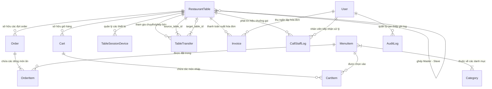

# TÀI LIỆU THIẾT KẾ VÀ HIỆN THỰC KIẾN TRÚC DOMAIN ENTITIES & DATABASE BACKEND
## Dự án: Hệ Thống Gọi Món Nhà Hàng Lẩu Hỏa Diệm Các (HoaDiemCat)

> **Môn học:** Kiểm thử phần mềm — Trường ĐH Sư phạm Kỹ thuật TP.HCM (HCMUTE)  
> **Backend Framework:** Java 21, Spring Boot 3.3.4, Spring Data JPA / Hibernate, MySQL / PostgreSQL  
> **Quy chuẩn tuân thủ:** 10 Quy định nghiệp vụ cốt lõi (QĐ1 – QĐ10), Đặc tả Use Case Chương 3 (UC01 – UC38), Mô hình Cụm bàn Master-Slave và Cơ chế bảo vệ 2-Phase Lock Chuyển/Ghép bàn.

---

## 1. Tổng Quan Kiến Trúc Dữ Liệu

Kiến trúc tầng thực thể (Domain Entities Layer) của Hỏa Diệm Các được xây dựng theo chuẩn **Domain-Driven Design (DDD)** và chuẩn hóa quan hệ thực thể tối ưu cho ứng dụng chạy thời gian thực:
- Mọi Entity đều kế thừa từ `BaseEntity` (tự động hóa quản lý `id`, thời điểm tạo `createdAt`, cập nhật `updatedAt` thông qua `@PrePersist` và `@PreUpdate`).
- Áp dụng triệt để `FetchType.LAZY` trên toàn bộ quan hệ `@ManyToOne` và `@OneToMany` nhằm loại bỏ triệt để vấn đề truy vấn thừa N+1 queries.
- Thiết lập chiến lược lập chỉ mục (Database Indexing) trên các cột thường xuyên tìm kiếm, lọc hoặc kiểm tra bảo mật (`table_number`, `session_token`, `status`, `device_token`, `transfer_code`).
- Đảm bảo tính toàn vẹn dữ liệu với các khóa ngoại (Foreign Keys), ràng buộc Unique (`table_number`, `username`, `email`, `transfer_code`, `invoice_code`, `code`) và khóa mềm (Soft Delete).

---

## 2. Sơ đồ Quan Hệ Thực Thể Toàn Diện (ERD - Mermaid Diagram)

---

## 3. Danh Mục Chi Tiết 13 Domain Entities (`com.hoadiemcat.entity`)

### 3.1. `BaseEntity` (Lớp Cơ Sở Dùng Chung)
- **Mục đích:** Cung cấp khóa chính và các mốc thời gian kiểm toán tự động cho mọi bảng dữ liệu.
- **Các trường:**
  - `id` (Long, `@Id`, `@GeneratedValue(IDENTITY)`): Khóa chính tự tăng.
  - `createdAt` (LocalDateTime, `@Column(updatable = false)`): Thời điểm khởi tạo bản ghi.
  - `updatedAt` (LocalDateTime): Thời điểm cập nhật bản ghi gần nhất.
- **Lifecycle Callbacks:** `@PrePersist` tự động gán `createdAt = now()`, `@PreUpdate` tự động gán `updatedAt = now()`.

---

### 3.2. `RestaurantTable` (Bảng `restaurant_tables`)
- **Mục đích:** Đại diện cho một bàn ăn trong nhà hàng. Quản lý trạng thái bàn (QĐ7), cờ khóa order khẩn cấp (QĐ3, UC29), vòng đời Dynamic Session Token (QĐ2, UC01, UC28, UC32), cơ chế xoay vòng mã PIN 4 số chống Brute-Force, và mô hình Cụm bàn (Master-Slave Clustering).
- **Các chỉ mục:** `idx_table_number` (Unique), `idx_table_session_token`, `idx_table_status`, `idx_table_area`.
- **Chi tiết các trường:**
  - `tableNumber` (VARCHAR(20), Unique, Not Null): Mã số bàn (VD: "B01", "VIP 11").
  - `name` (VARCHAR(100), Not Null): Tên hiển thị (VD: "Bàn số 01", "Phòng VIP Hoàng Triều").
  - `area` (EnumType.STRING, Not Null): Phân khu `COMMON` (Sảnh chung) hoặc `VIP` (Phòng VIP).
  - `capacity` (Integer, Not Null): Sức chứa số lượng khách tối đa.
  - `status` (EnumType.STRING, Not Null): `AVAILABLE` (Trống), `OCCUPIED` (Có khách), `CLEANING` (Dọn dẹp) theo QĐ7.
  - `isOrderLocked` (Boolean, Not Null, Default false): Cờ khóa quyền gửi đơn order của bàn theo QĐ3 và UC29.
  - `currentSessionToken` (VARCHAR(128)): Token phiên QR động hiện tại (UUID v4 kết hợp băm an toàn theo QĐ2).
  - `sessionStartedAt` (LocalDateTime): Thời điểm khách đầu tiên quét QR mở bàn (dùng tính thời gian ngồi ăn).
  - `qrCodeUrl` (VARCHAR(500)): Đường dẫn ảnh mã QR phục vụ in ấn.
  - `currentPasscode` (VARCHAR(10)): Mã PIN 4 chữ số ngẫu nhiên của bàn ăn (`SecureRandom`).
  - `passcodeCreatedAt` (LocalDateTime): Thời điểm sinh mã PIN hiện tại.
  - `failedAttempts` (Integer, Not Null, Default 0): Số lần liên tiếp nhập sai mã PIN.
  - `lockedUntil` (LocalDateTime): Thời điểm hết hạn khóa tạm thời khi nhập sai quá 5 lần (khóa 60 giây).
  - `maxActiveDevices` (Integer, Not Null, Default = capacity * 1.5): Số lượng thiết bị tối đa được kết nối đồng thời.
  - `activeDeviceCount` (Integer, Not Null, Default 0): Số thiết bị hiện đang kết nối hợp lệ.
  - `masterTable` (`@ManyToOne`, FetchType.LAZY): Bàn chính mà bàn này đang ghép vào (nếu là bàn phụ Slave).
  - `linkedTables` (`@OneToMany`, FetchType.LAZY): Danh sách các bàn phụ đang ghép vào bàn này (nếu là bàn chính Master).
- **Business Methods:**
  - `isTemporarilyLocked()`: Kiểm tra bàn có đang trong thời gian bị khóa do brute-force.
  - `generateNewPasscode()`: Sinh mã PIN 4 số mới và reset bộ đếm lỗi.
  - `recordFailedAttempt()`: Ghi nhận 1 lần sai PIN, nếu đạt 5 lần thì khóa 60 giây (`lockedUntil = now + 60s`).
  - `resetFailedAttempts()`: Xóa sạch bộ đếm lỗi khi nhập đúng PIN.
  - `isMaster()`: Kiểm tra bàn có phải là Bàn chính quản lý cụm bàn hay không.
  - `isLinked()`: Kiểm tra bàn có đang đóng vai trò bàn phụ ghép vào bàn khác hay không.
  - `getEffectiveTable()`: Trả về chính nó hoặc trả về Master Table để dồn hóa đơn và order.

---

### 3.3. `TableSessionDevice` (Bảng `table_session_devices`)
- **Mục đích:** Quản lý từng thiết bị khách hàng kết nối vào phiên bàn ăn (UC35). Phân định rõ rệt quyền Chủ Bàn (Host) và Thành viên (Member).
- **Các chỉ mục:** `idx_device_token`, `idx_device_table_active`.
- **Chi tiết các trường:**
  - `table` (`@ManyToOne`, FetchType.LAZY, Not Null): Bàn ăn thiết bị đang kết nối.
  - `deviceToken` (VARCHAR(128), Not Null): Token định danh thiết bị (UUID v4).
  - `deviceName` (VARCHAR(100)): Tên hiển thị của thiết bị (VD: "Chủ bàn (iPhone 15)", "Khách 2 (Samsung S24)").
  - `deviceFingerprint` (VARCHAR(255)): Dấu vân tay thiết bị / User-Agent.
  - `isHost` (Boolean, Not Null, Default false): Cờ đánh dấu Chủ Bàn (chỉ Host mới có quyền bấm Gửi Đơn Bếp, Chuyển/Ghép bàn, Đá thiết bị khác).
  - `isActive` (Boolean, Not Null, Default true): Trạng thái kết nối.
  - `connectedAt` (LocalDateTime): Thời điểm kết nối lần đầu.
  - `lastActiveAt` (LocalDateTime): Thời điểm gửi request hoặc ping gần nhất.

---

### 3.4. `TableTransfer` (Bảng `table_transfers`)
- **Mục đích:** Quản lý giao dịch Chuyển bàn (1:1) hoặc Ghép bàn (N:1) áp dụng cơ chế Khóa tạm thời 2 giai đoạn (2-Phase Lock với TTL 5 phút) để bảo toàn giỏ hàng (UC33, UC34).
- **Các chỉ mục:** `idx_transfer_code` (Unique), `idx_transfer_status_expires`, `idx_transfer_source_table`.
- **Chi tiết các trường:**
  - `transferCode` (VARCHAR(20), Unique, Not Null): Mã điều chuyển (VD: "TRF-8492").
  - `transferType` (EnumType.STRING, Not Null): `MOVE` (Chuyển bàn 1:1) hoặc `MERGE` (Ghép bàn N:1).
  - `sourceTable` (`@ManyToOne`, FetchType.LAZY, Not Null): Bàn nguồn.
  - `targetTable` (`@ManyToOne`, FetchType.LAZY): Bàn đích.
  - `sourceSessionToken` (VARCHAR(128), Not Null): Token phiên bàn nguồn tại thời điểm xuất mã.
  - `status` (EnumType.STRING, Not Null): `PENDING`, `COMPLETED`, `CANCELLED`, `EXPIRED`.
  - `expiresAt` (LocalDateTime, Not Null): Thời điểm hết hạn hiệu lực của mã (hiện tại + 5 phút).
  - `sourcePasscode` (VARCHAR(10)): Mã PIN bàn nguồn để đối soát.
  - `targetPasscode` (VARCHAR(10)): Mã PIN bàn đích đã nhập để xác thực 2 chiều (Two-Way Handshake).
  - `requestedBy` (VARCHAR(128)): Device token của người khởi tạo yêu cầu.
  - `confirmedBy` (VARCHAR(128)): Device token của người xác nhận tại bàn đích.
  - `reason` (VARCHAR(255)): Lý do đổi/ghép bàn.

---

### 3.5. `Category` (Bảng `categories`)
- **Mục đích:** Phân loại danh mục món ăn trong thực đơn (UC02, UC10, UC25).
- **Các trường:**
  - `name` (VARCHAR(100), Not Null): Tên danh mục (VD: "Nước Lẩu Hoàng Gia", "Bò Thượng Hạng & Wagyu").
  - `slug` (VARCHAR(100), Unique, Not Null): Đường dẫn URL thân thiện (VD: "nuoc-lau-hoang-gia").
  - `description` (TEXT): Mô tả chi tiết.
  - `displayOrder` (Integer, Default 0): Thứ tự ưu tiên sắp xếp trên thanh cuộn menu (UC25).
  - `isActive` (Boolean, Not Null, Default true): Cờ bật/tắt hiển thị danh mục.
  - `isSystem` (Boolean, Not Null, Default false): Đánh dấu danh mục hệ thống tự động tổng hợp (như "Bán chạy" theo QĐ5, BR25.1).
  - `menuItems` (`@ManyToMany`): Liên kết danh sách món ăn thuộc danh mục.

---

### 3.6. `MenuItem` (Bảng `menu_items`)
- **Mục đích:** Lưu trữ thông tin chi tiết món ăn, đơn giá, số lượt gọi, và tình trạng còn/hết hàng (UC02, UC03, UC10, UC19, UC24, UC26).
- **Các trường:**
  - `code` (VARCHAR(30), Unique, Not Null): Mã định danh món (VD: "M01", "M02").
  - `name` (VARCHAR(200), Not Null): Tên món ăn.
  - `description` (TEXT): Thành phần, hương vị, hướng dẫn nhúng lẩu.
  - `price` (BigDecimal, Not Null, Precision 15, Scale 2): Đơn giá hiện hành (VND).
  - `unit` (VARCHAR(50)): Đơn vị tính (VD: "Khay 250g", "Nồi lẩu", "Đĩa").
  - `imageUrl` (VARCHAR(1000)): Link ảnh món ăn trên Cloudinary.
  - `isAvailable` (Boolean, Not Null, Default true): Tình trạng Còn hàng / Hết hàng theo QĐ4 và UC19.
  - `isFeatured` (Boolean, Not Null, Default false): Đánh dấu món ăn đặc sắc / Best-seller.
  - `isDeleted` (Boolean, Not Null, Default false): Cờ xóa mềm (Soft Delete) theo BR24.1.
  - `totalOrderedCount` (Long, Default 0): Tổng số lượt món đã được gọi phục vụ thành công để phục vụ xếp hạng món bán chạy (QĐ5).
  - `categories` (`@ManyToMany` via `menu_item_categories`): Các danh mục chứa món này.

---

### 3.7. `Cart` (Bảng `carts`) & `CartItem` (Bảng `cart_items`)
- **Mục đích:** Quản lý giỏ hàng cộng tác thời gian thực tại bàn (Collaborative Realtime Cart) (UC04, UC21, UC22, UC23).
- **Chi tiết `Cart`:**
  - `restaurantTable` (`@ManyToOne`, FetchType.LAZY, Not Null): Bàn sở hữu giỏ.
  - `sessionToken` (VARCHAR(128), Not Null): Gắn chặt với phiên QR động hiện tại.
  - `items` (`@OneToMany`, cascade = ALL, orphanRemoval = true): Danh sách món trong giỏ.
- **Chi tiết `CartItem`:**
  - `cart` (`@ManyToOne`, FetchType.LAZY, Not Null): Giỏ hàng cha.
  - `menuItem` (`@ManyToOne`, FetchType.LAZY, Not Null): Món ăn được chọn.
  - `quantity` (Integer, Not Null): Số lượng món ($1 \le N \le 99$ theo QĐ9, UC22).
  - `note` (VARCHAR(255)): Ghi chú riêng cho món (VD: "Không hành lá", "Nước lẩu cay ít").

---

### 3.8. `Order` (Bảng `orders`) & `OrderItem` (Bảng `order_items`)
- **Mục đích:** Quản lý từng đợt gọi món (Order Round) gửi vào bếp KDS theo thời gian thực (UC05, UC06, UC13, UC17, UC18).
- **Chi tiết `Order`:**
  - `restaurantTable` (`@ManyToOne`, FetchType.LAZY, Not Null): Bàn thực hiện order.
  - `sessionToken` (VARCHAR(128), Not Null): Token phiên bàn tại thời điểm bấm gửi. Ngăn rò rỉ đơn của phiên cũ (Order Isolation).
  - `roundNumber` (Integer, Not Null, Default 1): Đợt gọi món thứ mấy (Đợt 1, Đợt 2, Đợt 3...) theo QĐ6.
  - `status` (EnumType.STRING, Not Null): `PENDING` (Chờ bếp), `COOKING` (Đang nấu), `COMPLETED` (Hoàn tất), `CANCELLED` (Đã hủy).
  - `totalAmount` (BigDecimal, Not Null): Tổng tiền của riêng đợt gọi này.
  - `orderItems` (`@OneToMany`, cascade = ALL, orphanRemoval = true): Danh sách món thuộc đợt order.
- **Chi tiết `OrderItem`:**
  - `order` (`@ManyToOne`, FetchType.LAZY, Not Null): Đợt order cha.
  - `menuItem` (`@ManyToOne`, FetchType.LAZY, Not Null): Món ăn được đặt.
  - `price` (BigDecimal, Not Null): Đơn giá tại thời điểm đặt món (bảo toàn giá lịch sử).
  - `quantity` (Integer, Not Null): Số lượng phần ăn ($1 \le N \le 99$ theo QĐ9).
  - `note` (VARCHAR(255)): Ghi chú chế biến.
  - `status` (EnumType.STRING, Not Null): `COOKING` (Đang chuẩn bị), `SERVED` (Đã phục vụ ra bàn), `CANCELLED` (Đã hủy) theo QĐ8.
  - `servedAt` (LocalDateTime): Thời điểm nhân viên bếp/phục vụ hoàn tất ra món (UC18).
  - `cancelledReason` (VARCHAR(255)): Lý do hủy món (nếu có Quản lý can thiệp theo UC13).

---

### 3.9. `Invoice` (Bảng `invoices`)
- **Mục đích:** Lưu trữ hóa đơn thanh toán kết thúc phiên bàn ăn, đối soát doanh thu và in phiếu thanh toán (UC15, UC30, UC31, UC32, UC37).
- **Các chỉ mục:** `idx_invoice_code` (Unique), `idx_invoice_table_id`, `idx_invoice_session_token`, `idx_invoice_status`.
- **Chi tiết các trường:**
  - `invoiceCode` (VARCHAR(50), Unique, Not Null): Mã số hóa đơn duy nhất (VD: "HD-20260914-0001").
  - `restaurantTable` (`@ManyToOne`, FetchType.LAZY, Not Null): Bàn ăn thanh toán.
  - `sessionToken` (VARCHAR(128), Not Null): Token phiên đã kết thúc.
  - `subtotal` (BigDecimal, Not Null): Tổng tiền món ăn của toàn bộ các đợt order trước chiết khấu và thuế (QĐ1).
  - `discountPercent` (BigDecimal, Default 0): Tỷ lệ chiết khấu khuyến mãi (%).
  - `discountAmount` (BigDecimal, Default 0): Số tiền được giảm trừ khuyến mãi (VND).
  - `vatPercent` (BigDecimal, Default 8): Tỷ lệ thuế giá trị gia tăng (mặc định 8% hoặc 10%).
  - `vatAmount` (BigDecimal, Not Null): Số tiền thuế VAT tương ứng.
  - `totalAmount` (BigDecimal, Not Null): Tổng tiền thanh toán cuối cùng theo công thức QĐ1: `totalAmount = subtotal - discountAmount + vatAmount`.
  - `paymentMethod` (EnumType.STRING, Not Null): `CASH` (Tiền mặt) hoặc `VIETQR` (Chuyển khoản VietQR Napas247).
  - `paymentStatus` (EnumType.STRING, Not Null): `PENDING`, `PAID`, `CANCELLED`, `FAILED`.
  - `paidAt` (LocalDateTime): Thời điểm khách hoàn tất thanh toán.
  - `cashier` (`@ManyToOne`, FetchType.LAZY): Tài khoản nhân viên/thu ngân thực hiện chốt hóa đơn.
  - `note` (VARCHAR(500)): Ghi chú thanh toán hoặc thông tin gộp bàn.

---

### 3.10. `CallStaffLog` (Bảng `call_staff_logs`)
- **Mục đích:** Ghi nhận lịch sử tín hiệu chuông gọi nhân viên và yêu cầu thanh toán từ bàn ăn (UC07, UC08, UC14, UC38).
- **Chi tiết các trường:**
  - `restaurantTable` (`@ManyToOne`, FetchType.LAZY, Not Null): Bàn phát tín hiệu.
  - `requestType` (EnumType.STRING, Not Null): `CALL_STAFF` (Gọi nhân viên), `PAYMENT_REQUEST` (Yêu cầu tính tiền), `ICE_WATER` (Thêm đá/nước), `UTENSILS` (Chén dĩa), `OTHER` (Khác).
  - `message` (VARCHAR(255)): Nội dung ghi chú hỗ trợ kèm theo.
  - `status` (EnumType.STRING, Not Null): `PENDING` (Chờ xử lý), `RESOLVED` (Đã phục vụ xong), `CANCELLED` (Đã hủy).
  - `resolvedAt` (LocalDateTime): Thời điểm nhân viên xử lý xong yêu cầu.
  - `resolvedBy` (`@ManyToOne`, FetchType.LAZY): Tài khoản nhân viên xử lý.

---

### 3.11. `AuditLog` (Bảng `audit_logs`)
- **Mục đích:** Nhật ký kiểm toán minh bạch ghi lại toàn bộ các thao tác can thiệp order của Quản lý (UC13, BR13.1).
- **Chi tiết các trường:**
  - `actor` (`@ManyToOne`, FetchType.LAZY, Not Null): Tài khoản thực hiện hành động.
  - `action` (VARCHAR(50), Not Null): Tên hành động (VD: "CANCEL_ORDER_ITEM", "UPDATE_QUANTITY", "LOCK_ORDER", "REVOKE_QR").
  - `targetEntity` (VARCHAR(50), Not Null): Bảng bị can thiệp ("OrderItem", "RestaurantTable", "Order").
  - `targetId` (Long, Not Null): ID của bản ghi dữ liệu bị can thiệp.
  - `reason` (VARCHAR(500), Not Null): **Lý do bắt buộc** khi Quản lý can thiệp (BR13.1).
  - `metadataJson` (TEXT): Dữ liệu chi tiết trước và sau khi can thiệp (dạng JSON).

---

### 3.12. `User` (Bảng `users`)
- **Mục đích:** Quản lý tài khoản đăng nhập của nhân sự nhà hàng (UC09, UC36).
- **Các trường:**
  - `username` (VARCHAR(50), Unique, Not Null): Tên đăng nhập.
  - `password` (VARCHAR(255), Not Null): Mật khẩu đã mã hóa an toàn BCrypt.
  - `fullName` (VARCHAR(100), Not Null): Họ và tên nhân viên.
  - `email` (VARCHAR(100), Unique, Not Null): Email liên hệ nhận mật khẩu.
  - `phoneNumber` (VARCHAR(20)): Số điện thoại liên lạc.
  - `role` (EnumType.STRING, Not Null): `ADMIN`, `MANAGER`, `KITCHEN`, `STAFF`, `USER`.
  - `status` (EnumType.STRING, Not Null): `ACTIVE`, `INACTIVE`, `PENDING`, `DELETED`.
  - `lastLoginAt` (LocalDateTime): Thời điểm đăng nhập gần nhất.

---

## 4. Danh Mục 12 Enums Hệ Thống (`com.hoadiemcat.entity.enums`)

1. **`Role`**: Phân quyền tài khoản nhân sự: `ADMIN` (Toàn quyền), `MANAGER` (Quản lý sảnh), `KITCHEN` (Trạm Bếp KDS), `STAFF` (Phục vụ / Thu ngân), `USER` (Khách hàng vãng lai).
2. **`Status`**: Trạng thái tài khoản người dùng: `ACTIVE`, `INACTIVE`, `PENDING`, `DELETED`.
3. **`TableStatus`**: Trạng thái vận hành bàn ăn theo QĐ7: `AVAILABLE` (Bàn trống), `OCCUPIED` (Đang có khách ngồi), `CLEANING` (Đang dọn dẹp vệ sinh).
4. **`TableArea`**: Phân khu vực bố trí bàn ăn: `COMMON` (Khu sảnh chung), `VIP` (Phòng VIP Hoàng Triều).
5. **`TransferType`**: Hình thức điều chuyển bàn: `MOVE` (Chuyển bàn 1:1), `MERGE` (Ghép bàn N:1 vào cụm tiệc lớn).
6. **`TransferStatus`**: Trạng thái giao dịch chuyển/ghép bàn: `PENDING` (Đang chờ nhập mã), `COMPLETED` (Đã hoàn tất), `CANCELLED` (Đã hủy), `EXPIRED` (Hết hạn 5 phút).
7. **`OrderStatus`**: Trạng thái đợt gọi món: `PENDING` (Mới gửi chờ tiếp nhận), `COOKING` (Bếp đang nấu), `COMPLETED` (Toàn bộ món đã ra bàn), `CANCELLED` (Đã hủy).
8. **`OrderItemStatus`**: Trạng thái từng món ăn theo QĐ8: `COOKING` (Bếp đang chuẩn bị), `SERVED` (Đã bưng ra bàn cho khách), `CANCELLED` (Đã hủy do hết nguyên liệu hoặc khách đổi ý).
9. **`PaymentMethod`**: Phương thức thanh toán: `CASH` (Tiền mặt), `VIETQR` (Chuyển khoản ngân hàng VietQR).
10. **`PaymentStatus`**: Trạng thái thanh toán hóa đơn: `PENDING` (Chờ thanh toán), `PAID` (Đã thanh toán), `CANCELLED` (Hủy), `FAILED` (Thất bại).
11. **`CallStaffType`**: Phân loại yêu cầu hỗ trợ: `CALL_STAFF` (Gọi nhân viên), `PAYMENT_REQUEST` (Yêu cầu thanh toán), `ICE_WATER` (Thêm đá / nước lẩu), `UTENSILS` (Thêm chén đũa), `OTHER` (Khác).
12. **`CallStaffStatus`**: Trạng thái chuông gọi: `PENDING` (Đang chờ tiếp nhận), `RESOLVED` (Đã hỗ trợ xong), `CANCELLED` (Hủy).

---

## 5. Ánh Xạ 10 Quy Định Nghiệp Vụ (QĐ1 – QĐ10) Vào Kiến Trúc Dữ Liệu

| Quy định | Nội dung quy định | Thực thi trong Domain Entities |
|---|---|---|
| **QĐ1** | Công thức tính hóa đơn: Tổng tiền món - Chiết khấu + VAT | Thực thi tại `Invoice`: `subtotal`, `discountAmount`, `vatAmount`, `totalAmount`. |
| **QĐ2** | Vòng đời Dynamic QR Code & Dynamic Session Token chống lộ QR | Thực thi tại `RestaurantTable.currentSessionToken` và `Invoice.sessionToken`. Khi đóng bàn, token cũ bị hủy bỏ hoàn toàn. |
| **QĐ3** | Khóa quyền order khẩn cấp của bàn ăn | Thực thi tại `RestaurantTable.isOrderLocked`. Khi `true`, chặn mọi thao tác gọi món mới từ khách. |
| **QĐ4** | Báo hết món khẩn cấp | Thực thi tại `MenuItem.isAvailable`. Khi `false`, món hiển thị hết hàng và không cho phép thêm vào giỏ. |
| **QĐ5** | Tự động tổng hợp danh mục "Bán chạy" | Thực thi tại `Category.isSystem` kết hợp `MenuItem.totalOrderedCount` tăng tự động sau mỗi món phục vụ thành công. |
| **QĐ6** | Đợt gọi món theo thời gian | Thực thi tại `Order.roundNumber` (Đợt 1, Đợt 2, Đợt 3...) và hiển thị trên dòng thời gian Timeline. |
| **QĐ7** | Trạng thái bàn ăn 3 pha | Thực thi tại `RestaurantTable.status` (`AVAILABLE` -> `OCCUPIED` -> `CLEANING` -> `AVAILABLE`). |
| **QĐ8** | Trạng thái chế biến món 3 pha | Thực thi tại `OrderItem.status` (`COOKING` -> `SERVED` hoặc `CANCELLED`). |
| **QĐ9** | Ràng buộc số lượng món $1 \le N \le 99$ | Thực thi tại `CartItem.quantity` và `OrderItem.quantity` với validation `@Min(1) @Max(99)`. |
| **QĐ10** | Tần suất chuông gọi phục vụ tối thiểu 30 giây | Thực thi tại `CallStaffLogRepository` kiểm tra bản ghi gần nhất của bàn trong vòng 30 giây. |
